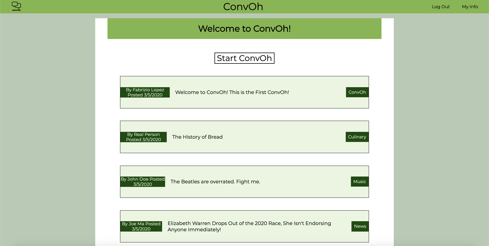
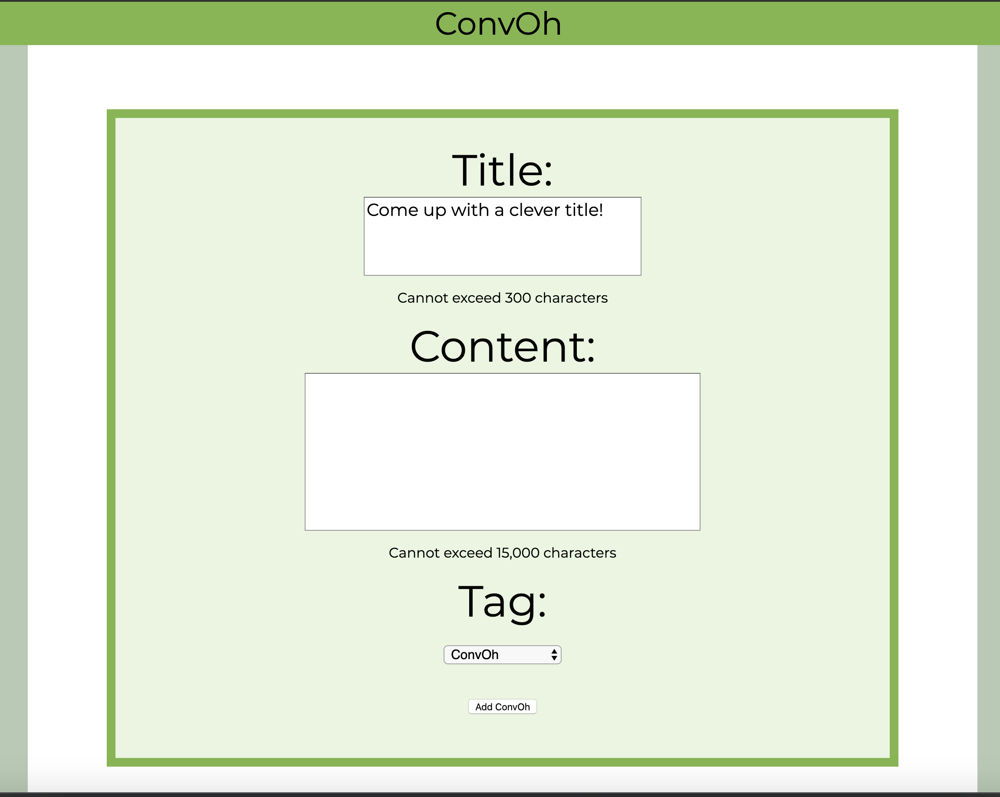
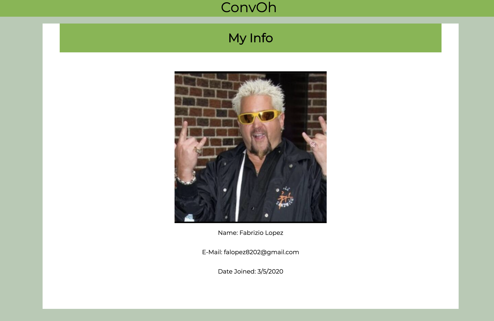
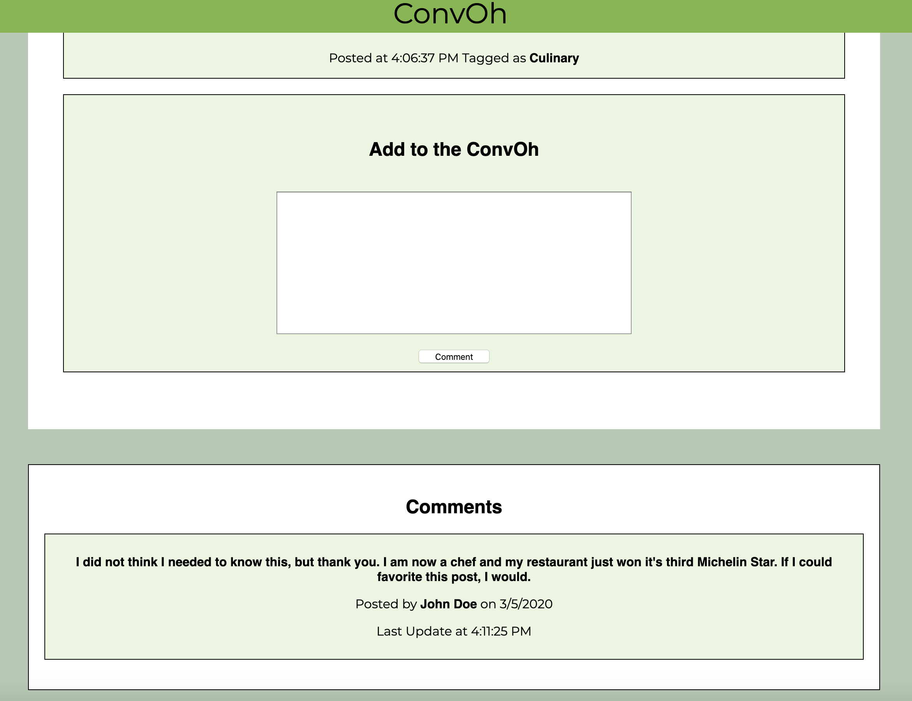

# convOh

## Description
A social media application where you can start a conversation with others! Converse about news, memes, sports, videogames, and more!

## Screenshots
### Home Page

### New Post Page

### Info Page

### Post Page

### Comments Section

## Technologies
- Javascript
- HTML
- CSS
- Node
- Express
- Mongoose
- mongoDB
- Google OAuth

## Getting Started
### Link to Trello planning board
[Link to Trello](https://trello.com/b/hlNU8aJB/social-media-app)

### Link to convOh app
[Link to Heroku](https://convoh.herokuapp.com)

## Future Enhancements
- Edit and have public profiles
- Add Likes and Dislikes
- Sort Posts by newest and most liked
- Add other users as friends
- Have a filter to see posts that are in your friends list
## Author
- **Fabrizio Lopez**